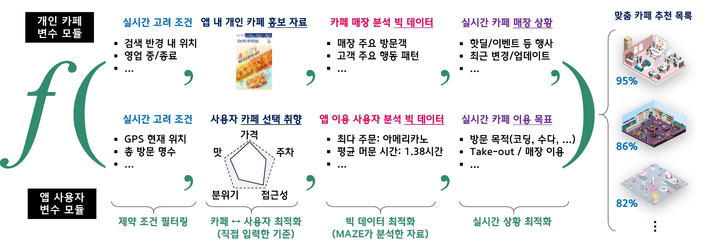

# The Big AI : A-MAZE 콘텐츠 기반 카페 추천 시스템
Installation 진행 후, `sh run.bin` 실행

## Introduction
### Hardware Specification
| 품목 | 규격 |
|------|------|
|CPU|Intel CPU Core I9-10920X|
|M/B| ASUS WS X299 SAGE|
|RAM | Samsung DDR4 16GB PC4-25600|
|SSD|SK Hynix Gold P31 M.2 NVMe (1TB)|
|VGA|GFORCE RTX3080Ti D6X 12GB Ref X4|

## Environment / Installation
Server : Ubuntu 20.04 x86_64  
Database : MongoDB

### Installation
#### 개발에 필요한 기본 패키지 설치
```shell
$ sudo apt-get update
$ sudo apt-get upgrade
$ sudo apt-get install vim nano build-essential zlib1g-dev libncurses5-dev libgdbm-dev libnss3-dev libssl-dev libreadline-dev libffi-dev wget gcc make python3-pip

```
#### 그래픽카드 드라이버 Installation
1. GPU와 호환되는 ubuntu diriver 설치하기
    ```shell 
    $ ubuntu-drivers devices
    ```
2. 설치 가능한 드라이버 리스트 확인하기
    ```shell 
    $ apt-cache search nvidia | grep nvidia-driver-{version}
    ```
3. 해당 저장소 추가하고, 패키지 매니저 업데이트
    ```shell 
    $ sudo add-apt-repository ppa:graphics-drivers/ppa
    $ sudo apt update
    ``` 
4. 해당 명령어로 설치된 드라이버 확인
    ```shell
    $ nvidia-smi
    ```

#### CUDA Installation
1. cuda toolkit 설치하기  
    ###### CUDA toolkit 12.0.0 /Linux / x86_64 / Ubuntu20.04 기준
    ```shell
    $ wget https://developer.download.nvidia.com/compute/cuda/repos/ubuntu2004/x86_64/cuda-keyring_1.0-1_all.deb
    $ sudo dpkg -i cuda-keyring_1.0-1_all.deb
    $ sudo apt-get update
    $ sudo apt-get -y install cuda
    ```
    다른 환경에 대한 설치방법은 [해당 링크](https://developer.nvidia.com/cuda-12-0-0-download-archive) 참조

#### CUDA 환경 설정
1. 아래 명령어로 설정파일 열기
    ```shell
    $ vim /etc/profile
    ```
2. 아래와 같은 명령어 입력
    ```shell
    $ export PATH=/usr/local/cuda-12.0/bin${PATH:+:${PATH}}
    $export LD_LIBRARY_PATH=/usr/local/cuda-12.0/lib64${LD_LIBRARY_PATH:+:${LD_LIBRARY_PATH}}
    $ export LD_LIBRARY_PATH=/usr/local/cuda-12.0/extras/CUPTI/lib64${LD_LIBRARY_PATH:+:${LD_LIBRARY_PATH}}
    ```
3. 설정 파일 적용하기
    ```shell
    $ source /etc/profile
    ```
#### cuDNN Installation  
1. [해당링크](https://developer.nvidia.com/rdp/cudnn-archive) 에서 CUDA 버전 및 서버 환경과 맞는 파일 다운로드 
2. 압축 풀고 설치하기
    ```shell
    $ unxz cudnn-linux-x86_64-8.7.0.84_cuda12-archive.tar.xz
    $ tar -xvf cudnn-linux-x86_64-8.7.0.84_cuda12-archive.tar

    $ sudo cp cudnn-linux-x86_64-8.7.0.84_cuda12-archive/include/* /usr/local/cuda-12/include
    $ sudo cp -P cudnn-linux-x86_64-8.7.0.84_cuda12-archive/lib/* /usr/local/cuda-12/lib64
    $ sudo chmod a+r /usr/local/cuda-12/lib64/libcudnn*

    $ cat /usr/local/cuda/include/cudnn_version.h | grep CUDNN_MAJOR -A 2
    ```

#### Python 3.12 Installation
```shell
$ tar -xvf Python-3.12.0a5.tar.xz
$ cd Python-3.12.0a5
$ ./configure --enable-optimizations
$ make -j 4
$ sudo make altinstall
$ sudo apt-get install python3-pip
```


#### Anaconda Installation 
1. [해당링크](https://repo.anaconda.com/archive/)에서 환경에 맞는 최신 버전 다운로드
    ```shell
    $ wget https://repo.anaconda.com/archive/Anaconda3-2023.07-2-Linux-x86_64.sh
    $ sudo bash Anaconda3-2021.05-Linux-x86_64.sh
    ```
2. Anaconda 설정하기
    ```shell
    $ source /usr/anaconda3/bin/activate 
    $ conda init
    $ source ~/.bashrc
    ```

#### 기타 패키지 Installation
```shell
$ sudo pip3 install -r requirements.txt
```

## Method
### A-MAZE의 콘텐츠 기반 추천 필터링 (Content-based Filtering in A-MAZE)

사용자가 방문한 카페의 특징을 기반으로한 유사도 분석 결과 및 사용자의 위치를 고려해서 사용자 맞춤 카페 목록을 제공함

#### 유사도 분석에 사용되는 카페의 특징
1. 카페의 시그니처 메뉴
2. 카페의 인기도, 좌석 점유율
3. 카페 이미지
4. 카페의 분위기
    - 카페의 분위기는 아래와 같은 요소로 판단함
        - 카페 방문객의 주요 행동 패턴
        - 카페 방문객의 연령대 및 성비

#### 알고리즘 (검토 후 플로우차트 추가 예정)
1. 로그를 기준으로 카페 별 분석 시작 
2. 분석 자료를 기반으로 카페 정보 임베딩 업데이트
    - 간단한 Feature Extraction 알고리즘을 통해 카페의 대표 이미지 5장에 대한 특징을 추출
    - 이미지 특징 및 시그니처 메뉴, 좌석 점유율, 그리고 카페의 분위기에 대한 정보를 One-Hot Encoding을 이용해 임베딩
3. 사용자 별 최다 방문 카페 분석
4. 최다 방문 카페의 임베딩과 유사한 카페 목록 찾기
    - 유사도 검사는 코사인 유사도 및 KNN 이용
5. 사용자 별 맞춤 카페 제공

#### 프로그램 수행 결과
데이터 베이스에 사용자 별 카페 추천 목록이 저장됨
| user_id | recommand_cafe_id | 
| --- | --- |
| int | object|

예시 데이터
| user_id | recommended_cafe | 
| --- | --- |
| 1 | `[{"cafe_id": 2,  "fitness": 82.7},  {"cafe_id": 5,  "fitness": 72.5,7}, {"cafe_id": 21,  "fitness": 62.1}]`|
| 3 | `[{"cafe_id": 1,  "fitness": 92.8},  {"cafe_id": 18,  "fitness": 92.5,7}, {"cafe_id": 19,  "fitness": 75.4}]`|

